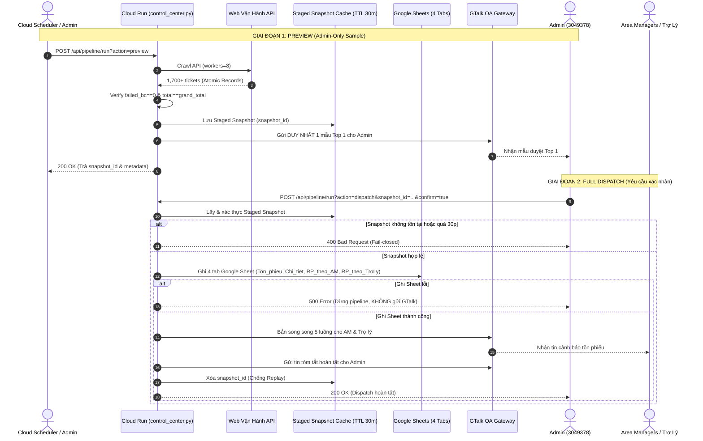

# GHN CONTROL CENTER V3 — KIẾN TRÚC PIPELINE & DATA INTEGRITY

## 1. TRẠNG THÁI HIỆN TẠI (SYSTEM STATUS)
- **Hạ tầng:** Google Cloud Run (Region: `asia-southeast1`, Project: `ghn-sheets-automation`).
- **Crawler:** 100% API đa luồng song song (`workers=8`, module `cao_ton_phieu_api.py` & `ghn_vanhanh_api.py`).
- **Phân tách luồng:** Hai giai đoạn Preview (Admin-only sample) và Full Dispatch (Yêu cầu `snapshot_id` + `confirm=true`).
- **Cloud Scheduler:** 3 jobs (`ghn-cron-all`, `ghn-cron-hoilay`, `ghn-hourly-ingestion-job`) đang ở trạng thái `PAUSED` an toàn.
- **Traffic:** 100% traffic production giữ nguyên, revision thử nghiệm chạy chế độ `--no-traffic`.

---

## 2. ENDPOINT MATRIX

| Method | Endpoint | Quyền & Secret | Khóa Lock | Mục Đích | Side Effects |
| :--- | :--- | :--- | :--- | :--- | :--- |
| `GET` | `/health` | Public | Không | Health Check hạ tầng Cloud Run | Không |
| `GET` | `/api/health/report` | `X-Scheduler-Secret` | Không | Probe nhẹ kết nối API, auth, latency | Read-only, `admin_notified=false` |
| `POST` | `/api/data-integrity/report` | `X-Scheduler-Secret` | `_scrape_lock` | Deep audit đối soát Web vs API từng BC | Không ghi Sheet, không gửi GTalk |
| `POST` | `/api/pipeline/run?action=preview` | `X-Scheduler-Secret` | `_scrape_lock` | Crawl, map RAM, gửi 1 mẫu Top 1 Admin | Tạo `snapshot_id` trong RAM, gửi 1 tin Admin |
| `POST` | `/api/pipeline/run?action=dispatch` | `X-Scheduler-Secret` | `_scrape_lock` | Ghi Sheet và bắn toàn bộ GTalk từ snapshot | Ghi 4 tab Google Sheet, gửi AM & Trợ lý |
| `POST` | `/api/dashboard/deploy` | `X-Scheduler-Secret` | Không | Đọc `Chi_tiet` deploy Cloudflare Pages | Deploy Cloudflare (Dashboard FREEZE) |

---

## 3. TRIGGER, WRITER & CELL OWNERSHIP MATRIX

| Thành Phần | Trigger / Caller | Quyền Ghi Sheet | Quyền Gửi GTalk | Ghi Chú An Toàn |
| :--- | :--- | :--- | :--- | :--- |
| **Health Probe** | Monitoring / Manual | **KHÔNG** | **KHÔNG** | Timeout 10s, deep audit fields = `null` |
| **Data Integrity**| Manual POST | **KHÔNG** | **KHÔNG** | Chiếm lock, trả 429 nếu bận |
| **Pipeline Preview**| Cloud Scheduler / Manual| **KHÔNG** | **CHỈ ADMIN (1 tin)** | Không gửi AM/Trợ lý, lưu RAM 30p |
| **Pipeline Dispatch**| Explicit Admin Confirm | **GHI 4 TAB** | **GỬI TOÀN BỘ** | Yêu cầu `snapshot_id` còn hạn, xóa snapshot sau khi gửi |

---

## 4. QUY TRÌNH 2 GIAI ĐOẠN (PREVIEW ➔ DISPATCH FLOW)

---

## 5. KẾ HOẠCH BẬT SCHEDULER & ROLLBACK

### 5.1 Kế hoạch chuyển Traffic & Bật Scheduler
1. **Kiểm tra Health:** Gọi `GET /api/health/report` xác nhận `api_status: HEALTHY`.
2. **Chuyển Traffic:** Chuyển 100% traffic Cloud Run sang revision đã xác thực.
3. **Cấu hình Scheduler:**
   - Job 1 (`0 6-13 * * *`): Gọi `/api/pipeline/run?action=preview&filter=ALL`.
   - Job 2 (`0 14-18 * * *`): Gọi `/api/pipeline/run?action=preview&filter=HOI_LAY`.
4. **Unpause Schedulers:** Mở lại 3 job sau khi duyệt production.

### 5.2 Kế hoạch Rollback (Khẩn Cấp)
- **Nếu phát hiện lỗi logic/data:** Chuyển ngay 100% traffic về revision stable trước đó (`ghn-control-center-00046-yiy` hoặc `ghn-control-center-00026-gjk`).
- **Tạm dừng tự động:** `gcloud scheduler jobs pause` toàn bộ 3 job.
- **Fail-closed:** Mọi lỗi bất thường đều tự động dừng trước bước ghi Sheet và gửi GTalk.
