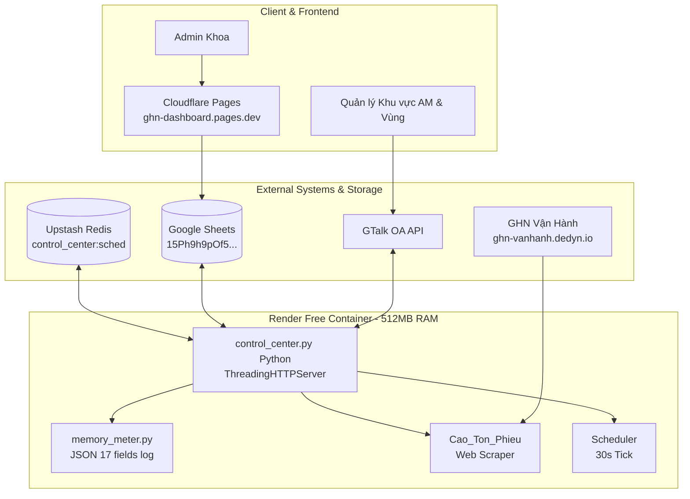

# ARCHITECTURE — GHN CONTROL CENTER

> **Prepared by:** Technical Lead  
> **Date:** 15/09/2026  
> **Version:** v2.0.0-PA2  

## 1. Sơ đồ Kiến trúc Tổng thể (Component & Deployment Diagram)

## 2. Luồng Dữ liệu (Data Flow & Scheduler Flow)
1. **Scheduler Trigger:** Tick mỗi 30s kiểm tra thời gian hiện tại khớp lịch `sched.json` / Redis.
2. **Raw Data Extraction:** `cao_ton_phieu.py` đăng nhập web vận hành GHN (`OP_WEB_USER`/`OP_WEB_PASS`), cào dữ liệu thô.
3. **Google Sheets Sync:** Đẩy dữ liệu thô (`Chi_tiet`, `Ton_phieu`) lên Google Sheets bằng Batch API.
4. **GTalk Dispatch:** Đọc dữ liệu từ RAM cache, gửi thông báo hối giao/lấy/trả tới AM và Trợ lý Vùng.
5. **Dashboard Consumption:** Cloudflare Pages đọc trực tiếp từ Google Sheets để render giao diện trực quan cho người dùng.
