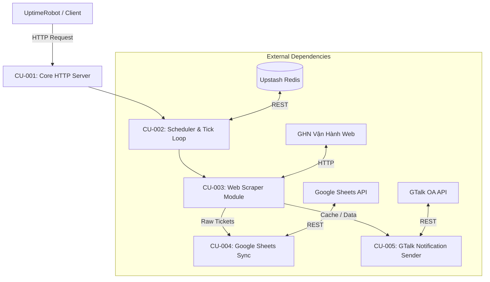

# DEPENDENCY GRAPH & SPOF — GHN CONTROL CENTER

> **Prepared by:** Technical Lead  
> **Date:** 15/09/2026  
> **Version:** v2.0.0-PA2  
> **Order Reference:** ORDER-003 (Change Impact Analysis)  

## 1. Sơ đồ Phụ thuộc (Dependency Graph)

## 2. Single Points of Failure (SPOF)
1. **Render Free Container (`srv-dafp8kn40ujc73cadrl0`):** Điểm nghẽn đơn duy nhất về phần cứng (512 MB RAM). Nếu container sập hoặc bị OOM Kill, toàn bộ hệ thống HTTP server, scheduler và cron ngưng hoạt động.
2. **GHN Vận Hành Web Server (`ghn-vanhanh.dedyn.io`):** Nếu hệ thống web nguồn sập hoặc thay đổi cấu trúc DOM, module scraper (CU-003) sẽ thất bại liên tiếp, kích hoạt cơ chế bảo vệ KN1/KN2.
3. **Upstash Redis / Google Sheets API:** Phụ thuộc vào dịch vụ bên ngoài để lưu trạng thái lịch và dữ liệu tồn phiếu. Mất kết nối dẫn đến fallback cục bộ hoặc lỗi ghi nhận.
