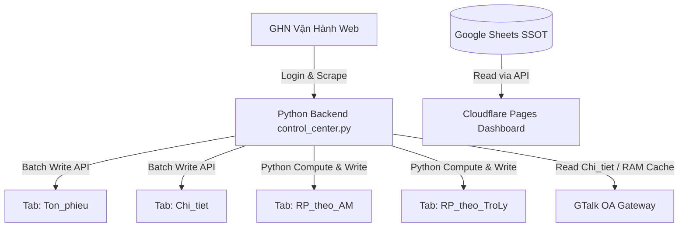

# SHEET DATA FLOW — GHN CONTROL CENTER

> **Prepared by:** Technical Lead  
> **Date:** 15/09/2026  
> **Version:** v2.0.0-PA2  
> **Order Reference:** ORDER-GS-001 (Google Sheets & Apps Script Full Audit)  

## 1. Luồng Dữ liệu Google Sheets (Data Flow Trace)

- **Source of Truth:** Google Sheets (`Chi_tiet`, `Ton_phieu`) lưu trữ dữ liệu thô do Backend Python cào về và đẩy lên.
- **Derived Data / Reports:** `RP_theo_AM` và `RP_theo_TroLy` được tính toán trực tiếp từ Python code (`cao_ton_phieu.py`) và ghi đè định kỳ mỗi chu kỳ cào.
- **Dashboard Dependency:** Dashboard tĩnh trên Cloudflare Pages đọc dữ liệu trực tiếp từ các tab Google Sheets qua API công khai hoặc key cấu hình.
- **GTalk Dependency:** Backend đọc từ RAM Cache (`_cached_chi_tiet`) hoặc tab `Chi_tiet` để soạn thảo và gửi tin nhắn nhắc phiếu cho AM và Trợ lý Vùng.
