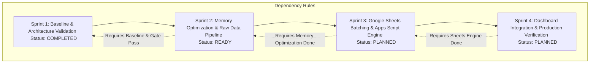

# SPRINT DEPENDENCY — GHN CONTROL CENTER

> **Prepared by:** Technical Lead  
> **Date:** 15/09/2026  
> **Version:** v2.0.0-PA2  
> **Order Reference:** ORDER-004 (Execution Readiness Gate)  

## 1. Sơ đồ Phụ thuộc Sprint (Sprint Dependency Graph)

## 2. Sprint Bắt buộc Phải Thực Hiện Trước
- **Sprint 1 (Hoàn thành):** Đóng băng Baseline, kiểm định kiến trúc, lập Impact Analysis và Execution Gate. Không thể nhảy cóc sang Sprint 2 nếu chưa qua Sprint 1.
- **Sprint 2 (Tiếp theo):** Bắt buộc phải thực hiện trước Sprint 3 để giải quyết triệt để rủi ro OOM Peak Memory (loại bỏ Global RAM Cache).
