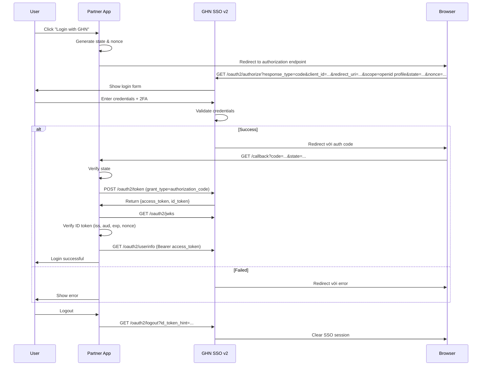

# GHN SSO v2 — OpenID Connect Integration Guide

## Overview

GHN SSO v2 cung cấp OpenID Connect (OIDC) identity provider cho phép third-party app xác thực nhân viên GHN an toàn.

**OpenID Connect** là identity layer trên OAuth 2.0, cho phép app verify danh tính user và lấy basic profile theo chuẩn.

## Prerequisites

1. **Client Registration** — liên hệ PhatLV (3079900) để đăng ký app, nhận:
   - `client_id`
   - `client_secret` (bảo mật tuyệt đối)
   - `redirect_uri` (HTTPS bắt buộc ở production)
2. **Environment:**
   - Staging: `https://dev-online-gateway.ghn.vn/sso-v2`
   - Production: `https://online-gateway.ghn.vn/sso-v2`

## Integration Flow



### Step 1: Authorization Request

```
GET https://dev-online-gateway.ghn.vn/sso-v2/public-api/oauth2/authorize?
  response_type=code&
  client_id={YOUR_CLIENT_ID}&
  redirect_uri={YOUR_REDIRECT_URI}&
  scope=openid%20profile%20email&
  state={RANDOM_STATE_VALUE}&
  nonce={RANDOM_NONCE_VALUE}
```

**Required:**
- `response_type=code`
- `client_id`
- `redirect_uri` (match chính xác)
- `scope` chứa `openid`, thêm `profile`, `email`
- `state` (random, chống CSRF)
- `nonce` (random, chống replay)

**Optional (PKCE):**
- `code_challenge`
- `code_challenge_method` (`S256` | `plain`)

### Step 2: Authorization Response

**Success:**

```
https://yourapp.com/callback?code={AUTHORIZATION_CODE}&state={YOUR_STATE_VALUE}
```

**Error:**

```
https://yourapp.com/callback?error=access_denied&error_description=...&state=...
```

⚠ Verify `state` match, code **hết hạn sau 60 giây**.

### Step 3: Exchange Code for Tokens

**Method 1: `client_secret_post`**

```
POST https://dev-online-gateway.ghn.vn/sso-v2/public-api/oauth2/token
Content-Type: application/x-www-form-urlencoded

grant_type=authorization_code&code=...&redirect_uri=...&client_id=...&client_secret=...
```

**Method 2: `client_secret_basic` (Recommended)**

```
POST https://dev-online-gateway.ghn.vn/sso-v2/public-api/oauth2/token
Authorization: Basic BASE64...ret)
Content-Type: application/x-www-form-urlencoded

grant_type=authorization_code&code=...&redirect_uri=...
```

**Success:**

```json
{
  "access_token": "eyJhbG...VCJ9...",
  "token_type": "Bearer",
  "expires_in": 604800,
  "id_token": "eyJhbG...VCJ9..."
}
```

**Error:**

```json
{
  "error": "invalid_grant",
  "error_description": "Authorization code is invalid or expired"
}
```

### Step 4: Verify ID Token

**Claims:**

```json
{
  "iss": "https://dev-online-gateway.ghn.vn/sso-v2/public-api",
  "sub": "12345",
  "aud": "your_client_id",
  "exp": 1672531200,
  "iat": 1672527600,
  "auth_time": 1672527600,
  "nonce": "...",
  "sid": "...",
  "name": "Nguyen Van A",
  "given_name": "A",
  "family_name": "Nguyen Van",
  "preferred_username": "Nguyen Van A",
  "phone_number": "+849****4567",
  "employee_id": 12345,
  "device_id": "..."
}
```

**Verify checklist:**

1. Signature bằng JWKS
2. `iss` đúng
3. `aud` = client_id của bạn
4. `exp` chưa hết hạn
5. `nonce` khớp

### Step 5: Get User Info

```
GET https://dev-online-gateway.ghn.vn/sso-v2/public-api/oauth2/userinfo
Authorization: Bearer ***
```

**Example curl:**

```bash
curl --location 'https://dev-online-gateway.ghn.vn/sso-v2/public-api/oauth2/userinfo' \
--header 'Authorization: Bearer ***'
```

**Response:**

```json
{
  "sub": "12345",
  "name": "Nguyen Van A",
  "given_name": "A",
  "family_name": "Nguyen Van",
  "preferred_username": "Nguyen Van A",
  "phone_number": "+849****4567",
  "employee_id": 12345,
  "jobtitle_name": "Nhân Viên Dịch Vụ Khách Hàng",
  "team_manager_id": 211859,
  "team_name": "Telesales Department",
  "team_id": 250558
}
```

### Step 6: User Logout

SSO-v2 hỗ trợ RP-Initiated Logout, user logout khỏi third-party app và SSO session cùng lúc.

#### 6.1. Logout Request

```
GET https://dev-online-gateway.ghn.vn/sso-v2/public-api/oauth2/logout?
  id_token_hint={ID_TOKEN}&
  post_logout_redirect_uri={YOUR_POST_LOGOUT_REDIRECT_URI}&
  state={RANDOM_STATE_VALUE}
```

| Parameter | Type | Description |
| --- | --- | --- |
| `id_token_hint` | `string` | **Recommended.** ID Token đã cấp cho client, dùng identify session. |
| `post_logout_redirect_uri` | `string` | **Optional.** URL SSO redirect user sau khi logout thành công. |
| `state` | `string` | **Optional.** Random value, include trong redirect về `post_logout_redirect_uri`, chống CSRF. |

#### 6.2. Logout Process

1. User redirect đến SSO logout endpoint.
2. SSO-v2 validate `id_token_hint` để identify user và session.
3. Tất cả token của user trên device đó bị invalidate.
4. SSO session kết thúc.
5. Nếu `post_logout_redirect_uri` hợp lệ → redirect user về URL đó. Nếu không → hiển thị success message.

#### 6.3. Back-Channel Logout

SSO-v2 hỗ trợ Back-Channel Logout (server-to-server). Khi user logout, SSO server sẽ gửi `logout_token` đến `backchannel_logout_uri` đã đăng ký cho mỗi client.

**App cần:**

1. Cung cấp `backchannel_logout_uri` lúc client registration.
2. Expose endpoint tại URI này, nhận POST với `logout_token`.
3. Khi nhận token: validate signature qua JWKS, validate `iss`/`aud`/`exp`, identify session theo `sub`/`sid`, terminate session.

## Security Best Practices

### 1. State Parameter

Luôn dùng cryptographically random `state`:

```javascript
// Generate random state
const state = crypto.randomBytes(32).toString('hex');
// Store in session
session.oauthState = state;
```

### 2. Nonce Parameter

Dùng random `nonce` chống replay:

```javascript
const nonce = crypto.randomBytes(32).toString('hex');
session.oauthNonce = nonce;
```

### 3. HTTPS Only

- Mọi communication phải HTTPS
- Redirect URIs phải HTTPS ở production
- Không bao giờ truyền secret qua HTTP

### 4. Client Secret Security

- Lưu client secret an toàn (env variables, secure vault)
- Không expose client secret trong client-side code
- Rotate secrets định kỳ

### 5. Token Validation

Luôn validate JWT:

```javascript
const jwt = require('jsonwebtoken');
const jwksClient = require('jwks-rsa');

const client = jwksClient({
  jwksUri: 'https://dev-online-gateway.ghn.vn/sso-v2/public-api/oauth2/jwks'
});

function getKey(header, callback) {
  client.getSigningKey(header.kid, (err, key) => {
    const signingKey = key.publicKey || key.rsaPublicKey;
    callback(null, signingKey);
  });
}

// Verify ID token
jwt.verify(idToken, getKey, {
  issuer: 'https://dev-online-gateway.ghn.vn/sso-v2/public-api',
  audience: 'your_client_id',
  algorithms: ['RS256']
}, (err, decoded) => {
  if (err) {
    // Token invalid
    return;
  }
  // Token valid, use decoded claims
});
```

## Service Discovery

GHN SSO v2 hỗ trợ OpenID Connect Discovery:

```
GET https://dev-online-gateway.ghn.vn/sso-v2/.well-known/openid-configuration
```

**Response:**

```json
{
  "issuer": "https://dev-online-gateway.ghn.vn/sso-v2/public-api",
  "authorization_endpoint": "https://dev-online-gateway.ghn.vn/sso-v2/public-api/oauth2/authorize",
  "token_endpoint": "https://dev-online-gateway.ghn.vn/sso-v2/public-api/oauth2/token",
  "userinfo_endpoint": "https://dev-online-gateway.ghn.vn/sso-v2/public-api/oauth2/userinfo",
  "jwks_uri": "https://dev-online-gateway.ghn.vn/sso-v2/public-api/oauth2/jwks",
  "response_types_supported": ["code"],
  "subject_types_supported": ["public"],
  "id_token_signing_alg_values_supported": ["RS256"],
  "scopes_supported": ["openid", "profile", "email"],
  "token_endpoint_auth_methods_supported": ["client_secret_post", "client_secret_basic"],
  "claims_supported": [
    "iss", "sub", "aud", "exp", "iat", "auth_time",
    "nonce", "sid", "name", "given_name", "family_name",
    "preferred_username", "phone_number", "employee_id"
  ],
  "code_challenge_methods_supported": ["S256", "plain"]
}
```

## Error Handling

### Authorization Endpoint Errors

| Error | Description | Action |
| --- | --- | --- |
| `invalid_request` | Missing or invalid parameters | Check request parameters |
| `invalid_client` | Invalid client_id | Verify client registration |
| `access_denied` | User denied access | Handle gracefully, allow retry |
| `server_error` | Server error | Retry after delay |

### Token Endpoint Errors

| Error | Description | Action |
| --- | --- | --- |
| `invalid_grant` | Invalid/expired authorization code | Restart flow |
| `invalid_client` | Invalid client credentials | Check client_id/secret |
| `invalid_request` | Malformed request | Fix request format |

### UserInfo Endpoint Errors

| Status | Error | Description |
| --- | --- | --- |
| 401 | `invalid_token` | Token expired/invalid |
| 403 | `insufficient_scope` | Token lacks required scope |
